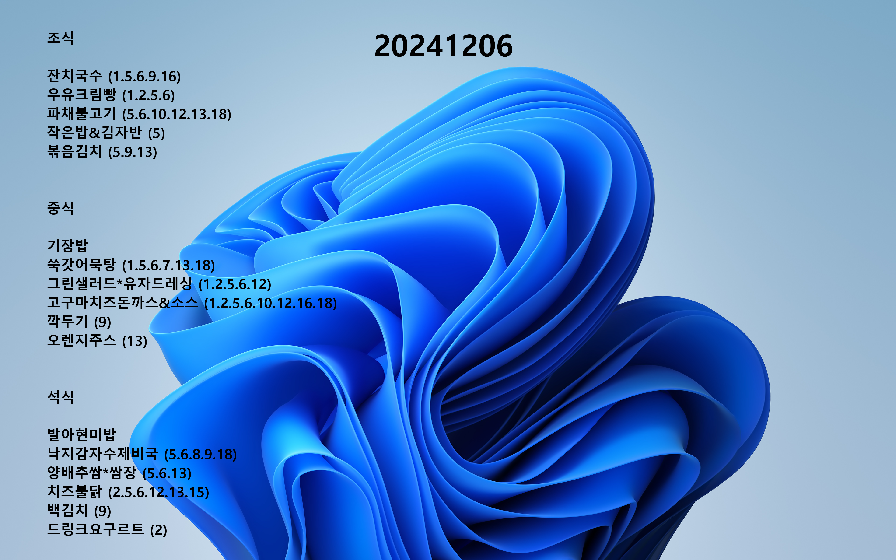

# 오늘의 급식

NEIS 오픈 API에서 오늘 급식(조식·중식·석식)을 받아와 이미지에 그린 뒤, Windows 바탕화면으로 자동 설정합니다.

Python 판과 Java 판이 같은 결과를 냅니다. Java 판은 JRE를 번들해서 Java가 없는 PC에서도 실행할 수 있습니다.



## 동작 방식

1. 오늘 날짜(`YYYYMMDD`)를 구합니다.
2. NEIS `mealServiceDietInfo` API를 조식(`1`)·중식(`2`)·석식(`3`)으로 각각 호출합니다.
3. `base.png` 위에 급식과 날짜를 그립니다.
4. 완성된 `YYYYMMDD.png`를 `SystemParametersInfoW(SPI_SETDESKWALLPAPER, ...)`로 바탕화면에 적용합니다.

## 파일 구조

```
base.png            배경 이미지 (두 구현이 공유)
example.png         README용 예시 결과
python/
  main.pyw          Python 구현
  requirements.txt
java/
  build.ps1         빌드 스크립트
  src/main/java/meal/Main.java   Java 구현
```

## Python 판

요구 사항: Windows, Python 3

```bash
pip install -r python/requirements.txt
python python/main.pyw
```

`.pyw` 확장자라 더블 클릭하면 콘솔 창 없이 실행됩니다. 결과 이미지는 리포 루트에 `YYYYMMDD.png`로 생성됩니다.

## Java 판

요구 사항: Windows, **빌드에만** JDK 21. 외부 라이브러리 의존성은 없습니다.

`user32.dll`을 `java.lang.foreign`(FFM)으로 직접 호출합니다. JDK 21에서 FFM은 preview라 컴파일·실행 모두 `--enable-preview`가 필요합니다.

### 빌드 및 실행

```powershell
cd java
.\build.ps1
java --enable-preview --enable-native-access=ALL-UNNAMED -jar .\build\dist\meal.jar
```

### Java가 없는 PC에 배포

빌드된 결과물이 [`release/MealWallpaper-1.0-win-x64.zip`](release/MealWallpaper-1.0-win-x64.zip)에 들어 있습니다. 압축을 풀고 `MealWallpaper.exe`를 실행하면 됩니다. JRE가 함께 들어 있어 **Java를 설치하지 않아도 동작합니다.**

직접 만들려면:

```powershell
.\build.ps1 -Package
```

`java\build\image\MealWallpaper\`(약 47MB)가 생기고, 같은 내용이 `release\`에 zip(약 32MB)으로도 저장됩니다.

### 실행 옵션

| 옵션 | 설명 |
| --- | --- |
| `--date YYYYMMDD` | 오늘 대신 지정한 날짜의 급식을 받습니다 |
| `--out <폴더>` | 출력 폴더. 기본값은 `%LOCALAPPDATA%\MealWallpaper` |
| `--no-wallpaper` | 이미지만 만들고 바탕화면은 건드리지 않습니다 |

## 다른 학교로 바꾸기

두 구현 모두 같은 값 두 개만 고치면 됩니다.

`python/main.pyw`

```python
class niesAPI:
    ATPT_OFCDC_SC_CODE = "I10";   # 시도교육청 코드
    SD_SCHUL_CODE = "9300058";    # 표준학교 코드
```

`java/src/main/java/meal/Main.java`

```java
private static final String ATPT_OFCDC_SC_CODE = "I10";
private static final String SD_SCHUL_CODE = "9300058";
```

코드 값은 NEIS 오픈 API의 `schoolInfo` 엔드포인트에서 학교명으로 조회할 수 있습니다.
